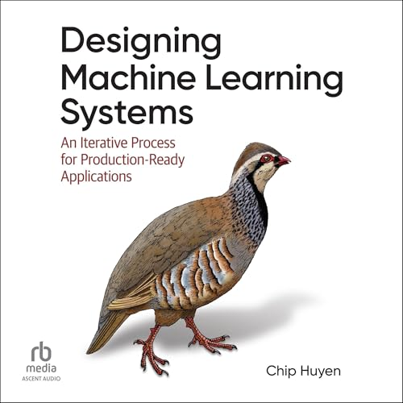
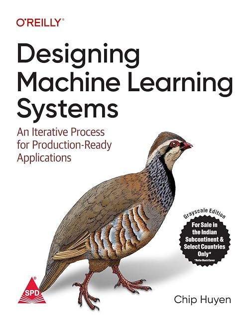

# Translations of Designing Machine Learning Systems

|  |  |
| --- | --- |
|  | **Chinese simplified** **Title:** *机器学习系统设计* **Publisher:** China Electric Power Press **Published:** April 30, 2024 **ISBN:** 9787519886288 **Links:** [Dangdang](http://product.dangdang.com/29696788.html), [O'Reilly China](https://oreillymedia.com.cn/index.php?func=book&isbn=978-7-5198-8628-8) |
|  | **Chinese complex** **Title:** *設計機器學習系統：迭代開發生產環境就緒的ML程式* **Publisher:** GoTop Information Inc. **Published:** October 31, 2023 **ISBN:** 9786263246423 **Links:** [GoTop](https://www.gotop.com.tw/books/BookDetails.aspx?Types=o&bn=A738) |
|  | **Japanese** **Title:** *機械学習システムデザイン：実運用レベルのアプリケーションを実現する継続的反復プロセス* **Publisher:** O'Reilly Japan Inc. **Published:** September 1, 2023 **ISBN:** 9784814400409 **Links:** [O'Reilly Japan](https://www.oreilly.co.jp/books/9784814400409/) |
|  | **Korean** **Title:** *머신러닝 시스템 설계: 프로젝트 범위 산정부터 프로덕션 배포 후 모니터링까지, MLOps 완벽 해부하기* **Publisher:** Hanbit **Published:** March 14, 2023 **ISBN:** 9791169210850 **Links:** [Hanbit](https://www.hanbit.co.kr/media/books/book_view.html?p_code=B1811121220), [YES24](https://www.yes24.com/product/goods/117843256) |
|  | **Vietnamese** **Title:** *Thiết kế hệ thống học máy: Quy trình lặp cho các ứng dụng hoàn chỉnh* **Publisher:** Nha Nam Publishing **Published:** July 14, 2025 **ISBN:** 9786047783779 **Links:** [Nha Nam](https://huyenchip.nhanam.vn/), [Facebook announcement](https://www.facebook.com/nhanampublishing/posts/pfbid0j4qygGh4nTLbDKDfyyPbkVXtWQa32DijbPfBt2tXmhrUGAZ8wJUoEcGkoe8pt5gcl) |
|  | **Thai** **Title:** *Designing Machine Learning Systems: An Iterative Process for Production-Ready Applications* **Publisher:** Documation / Core Function **Published:** December 12, 2022 **ISBN:** 9786168282304 **Links:** [SE-ED](https://m.se-ed.com/Detail/Designing-Machine-Learning-Systems/9786168282304), [A Book Distribution](https://www.a-bookdistribution.com/product/914664), [Lazada](https://www.lazada.co.th/products/designing-machine-learning-systems-i4258019199-s16857887502.html) |
|  | **Portuguese** **Title:** *Projetando sistemas de Machine Learning: processo interativo para aplicações prontas para produção* **Publisher:** Alta Books Editora **Published:** January 31, 2024 **ISBN:** 9788550819679 **Links:** [Alta Books](https://altabooks.com.br/produto/projetando-sistemas-de-machine-learning/), [Google Books](https://books.google.com/books/about/Projetando_sistemas_de_Machine_Learning.html?id=sQZi0AEACAAJ), [Amazon](https://www.amazon.com/PROJETANDO-SISTEMAS-MACHINE-LEARNING-Ravaglia/dp/8550819670) |
|  | **Spanish** **Title:** *Diseño de sistemas de Machine Learning: Un proceso iterativo para aplicaciones listas para funcionar* **Publisher:** Marcombo **Published:** July 7, 2023 **ISBN:** 9788426736956 **Links:** [Marcombo](https://www.marcombo.com/libro/libros-tecnicos-y-cientificos/informatica-libros-tecnicos-y-cientificos/otros-informatica/diseno-de-sistemas-de-machine-learning/), [Amazon](https://www.amazon.com/Dise%C3%B1o-sistemas-Machine-Learning-aplicaciones/dp/8426736955/), [Agapea](https://www.agapea.com/Chip-Huyen/Diseno-de-sistemas-de-Machine-Learning-9788426736956-i.htm), [Casa del Libro](https://www.casadellibro.com/libro-diseno-de-sistemas-de-machine-learning/9788426736956/13968905) |
|  | **Polish** **Title:** *Jak projektować systemy uczenia maszynowego: Iteracyjne tworzenie aplikacji gotowych do pracy* **Publisher:** Helion **Published:** February 28, 2023 **ISBN:** 9788328399129 **Links:** [Helion](https://helion.pl/ksiazki/jak-projektowac-systemy-uczenia-maszynowego-iteracyjne-tworzenie-aplikacji-gotowych-do-pracy-chip-huyen,jakpsu.htm#format/d) |
|  | **Russian** **Title:** *Проектирование систем машинного обучения* **Publisher:** Foliant **Published:** June 15, 2023 **ISBN:** 9786012717273 **Links:** [Flip](https://www.flip.kz/catalog?prod=3490235), [Chitai-Gorod](https://www.chitai-gorod.ru/product/proektirovanie-sistem-mashinnogo-obucheniya-2990668) |
|  | **Serbian** **Title:** *Mašinsko učenje: projektovanje sistema: Izrada aplikacija za upotrebu u praksi* **Publisher:** Mikro Knjiga **Published:** March 18, 2024 **ISBN:** 9788675554745 **Links:** [Mikro Knjiga](https://www.mikroknjiga.rs/masinsko-ucenje-projektovanje-sistema/46926), [iLearn](https://www.ilearn.rs/0210064-23016/masinsko-ucenje-projektovanje-sistema) |
|  | **Turkish** **Title:** *Makine Öğrenmesi Sistemleri Tasarlamak: Üretime Hazır Uygulamalar İçin Yinelemeli Bir Süreç* **Publisher:** Buzdagi Publishing **Published:** April 6, 2024 **ISBN:** 9786259855233 **Links:** [Buzdagi Publishing](https://www.buzdagikitabevi.com/makine-ogrenmesi-sistemleri-tasarlamak), [Kitapyurdu](https://www.kitapyurdu.com/kitap/makine-ogrenmesi-sistemleri-tasarlamak/680393.html), [Pazarama](https://www.pazarama.com/makine-ogrenmesi-sistemleri-tasarlamak-p-9786259855233), [Kitap Ambari](https://www.kitapambari.com/makine-ogrenmesi-sistemleri-tasarlamak-uretime-hazir-uygulamalar-icin-yinelemeli-bir-surec) |
|  | **Greek** **Title:** *Σχεδίαση Συστημάτων Μηχανικής Μάθησης: Μια Επαναληπτική Προσέγγιση για την Ανάπτυξη Έτοιμων για Παραγωγική Λειτουργία Εφαρμογών* **Publisher:** Papasotiriou **Published:** November 26, 2024 **ISBN:** 9789604911899 **Links:** [Papasotiriou](https://ekdoseis-papasotiriou.gr/products/9789604911899-chip-huyen-schediasi-systimaton-michanikis-mathisis), [Public](https://www.public.gr/product/books/greek-books/computer-science/program-instruction-manuals/sxediasi-sustimaton-mixanikis-mathisis/2004325), [Skroutz](https://www.skroutz.gr/s/57684992/Schediasi-Systimaton-Michanikis-Mathisis.html) |
|  | **English audiobook** **Title:** *Designing Machine Learning Systems: An Iterative Process for Production-Ready Applications* **Publisher:** Recorded Books / Ascent Audio **Published:** July 8, 2025 **ISBN:** 9781663753069 **Links:** [RBmedia](https://rbmediaglobal.com/audiobook/9781663753069/), [Audible](https://www.audible.in/pd/Designing-Machine-Learning-Systems-Audiobook/B0DX39X6G3), [Kobo](https://www.kobo.com/ww/en/audiobook/designing-machine-learning-systems-1), [OverDrive](https://www.overdrive.com/media/11642145/designing-machine-learning-systems) |
|  | **English reprint, India** **Title:** *Designing Machine Learning Systems: An Iterative Process for Production-Ready Applications* **Publisher:** Shroff / O'Reilly **Published:** June 1, 2022 **ISBN:** 9789355422675 **Note:** Grayscale Indian edition. **Links:** [Amazon India](http://amazon.in/Designing-Machine-Learning-Systems-Production-Ready/dp/9355422679), [AbeBooks](https://www.abebooks.com/9789355422675/Designing-Machine-Learning-Systems-Iterative-9355422679/plp), [Goodreads](https://www.goodreads.com/work/editions/95721327-designing-machine-learning-systems-an-iterative-process-for-production-) |
|  | **English reprint, Mainland China** **Title:** *设计机器学习系统（影印版）* / *Designing Machine Learning Systems* **Publisher:** Southeast University Press **Published:** September 15, 2022 **ISBN:** 9787576602241 **Note:** English-language reprint with a Chinese cover for mainland China. **Links:** [JD](https://item.jd.com/13385053.html) |
